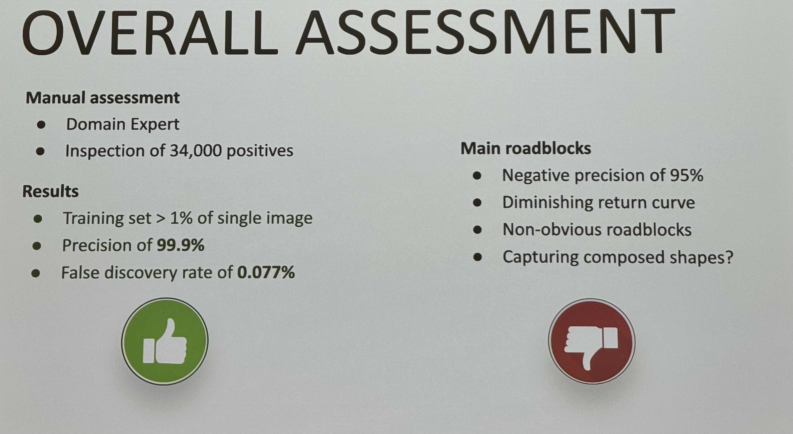
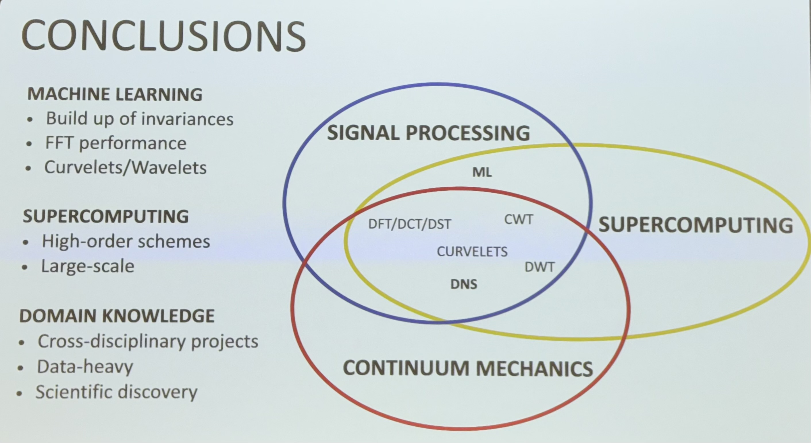

# HPC in Image Processing for Healthcare
Lecture presentation by Diego Rossinelli - Adjunct Professor & Associate Director at Stanford Institute for Computational and Mathematical Engineering (ICME)

## Large exisiting Biomedical Datasets
- Eye-related Diseases: Glaucoma and pressure of cerebrospinal fluid.
- Chronic Kidney Diseases: High-resolution animal models from the University of Zurich.

## Why large images?
High quality high volume images: Essential for detailed analysis and accurate diagnosis. 

- AI is then used for preservation and design of invariances and symmetries
- Addressing Model Accuracy: Overcoming challenges with small training sets and ensuring model performance

FFTs (Fast Fourier Transforms) are the currency

- Large images can be difficult to process due to the volume of data
-> Computer components have too little data transmission speeds: CPU, GPU, RAM, SSD, HDD bus bottleneck

🏎️ Supercomputers compute a 6k x 6k x 6k 3D image in 30 seconds vs 2 days on a laptop

**Architectural Destinctions of HPC** - They are not built like a workstation, but like a data center:
- Relax irrigularities
- High speed interconnects
- High speed storage
- Balanced compute power

Terrabytes vs Petaflops:
A flop is a floating point operation, a terrabyte is a unit of data storage
- 1TB = 10^12 bytes
- 1PF = 10^15 flops

## Benefits of image processing in healthcare

MRI, CT, X-ray: up to 95% of the granularity, allows for detailed reconstruction
- **3D reconstruction, dynamic analysis and flow simulation examples**:
    - Kidney glomerulus: By shape and density
    - Vascular flow in the brain
    - Blood flow in the heart
    - Measuring pressure of the ventricles
    - Computational orthopedics:
        - Simulate impact points on bone tissue using existing models

Usual techniques of recreating 3d FFT is using wavelights for image segmentation.

