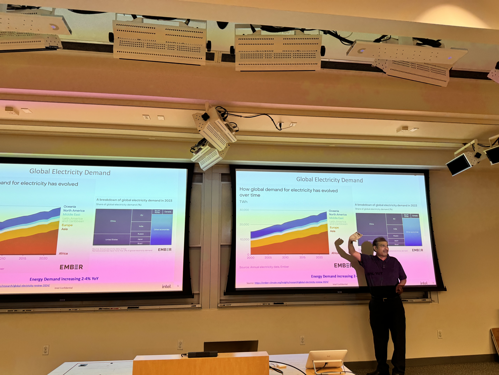
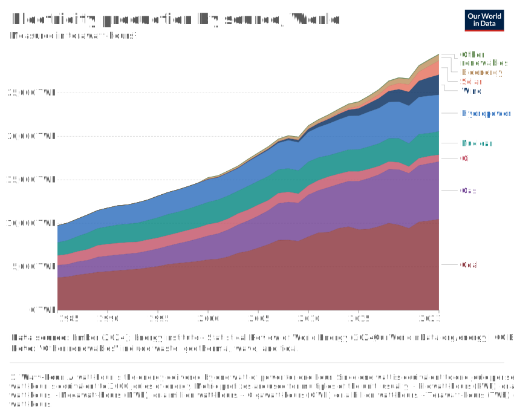
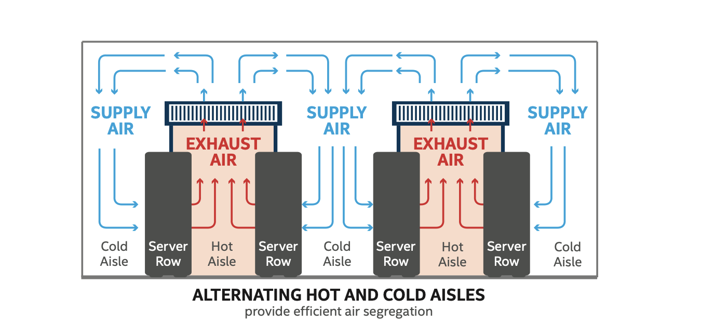
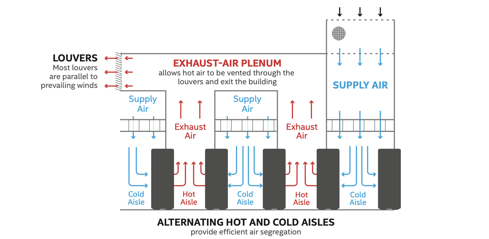

# Greener Hyperscale Datacenters
### Focused Energy Efficiency and Future Cleaner Power

Talk by Shesha Krishnapura, Intel Fellow, Intel Corporation on July 10th 2024 at HPC AI Seminar at Stanford (Received a letter by the Whitehouse for his work on energy efficiency)

## Agenda
- Electricity Demand Drivers
- Datacenter evolution power per rack, PUE, how and why power per rack is increasing
- Electricity Sources, Total Generation, Generation/Transmission Losses
- Environmental impact
- Fuel Cells
- Hydrogen - Why it needs to be the Future Key

### Data Center Impact
- Data centers consume 1-3% of global electricity
- Per 1 MW of IT load, a PUE (Power Usage Effectiveness) of 1.06 vs 1.5 translates to:
    - $385k+ lower in anual utility bills
    - 2,726 avoided tons of CO2 per year
    - same as 3,559 acres of forest absorbing CO2 in a year

China uses 3 times more electricity than the US - They supply the most products to the world. 

### Electricity Demand Drivers
1. Heat pumps
2. Air conditioning
3. Data centers
4. Electric Vehicles
5. Other Industry
6. Electrolysis for Hydrogen etc. 

Where the electricity comes from:

### Data Center Facility Evolution
- Power per rack has increased 10x in 25 years
    **from 42U/5KW in 1990 to 60U/43KW in 2025** (one U is 1.75 inches height)
- PUE has improved from 2.0 to 1.1
- Power per rack is increasing due to:
    - Moore's Law
    - More cores
    - More memory
    - More storage
    - More accelerators
    - More network bandwidth
    - More power per core
    - More power per memory
    - More power per storage
    - More power per accelerator
    - More power per network bandwidth

### Datacenter Cooling
[Link to Intel Power Efficiency in Data Centers](https://www.intel.com/content/dam/www/public/us/en/documents/best-practices/intel-it-extremely-energy-efficient-high-density-data-centers-paper.pdf)

- 2 types of cooling:
    - Free-Air cooling
    - Liquid cooling

#### Free-Air Cooling
Hot air pushes with such pressure - that bugs can't enter

- During cold times, datacenters mix cold air with computer heat
- During moist times, computer heat dries moist air

#### Liquid Cooling
Liquid cooling is 1000x more efficient than air cooling

Datacenters use **Grey Water** for cooling - cleaned by sewage treatment plants -  **50% cheaper than fresh water**

## Fuel Cells
- Fuel cells are 2x more efficient than combustion engines
- Fuel cells are 3x more efficient than grid electricity
- Fuel cells are 4x more efficient than grid electricity for data centers
- Fuel cells are 5x more efficient than grid electricity for data centers with waste heat recovery

## Why Hydrogen is the Future Key
- Hydrogen is the most abundant element in the universe
- Hydrogen is the most efficient energy carrier
