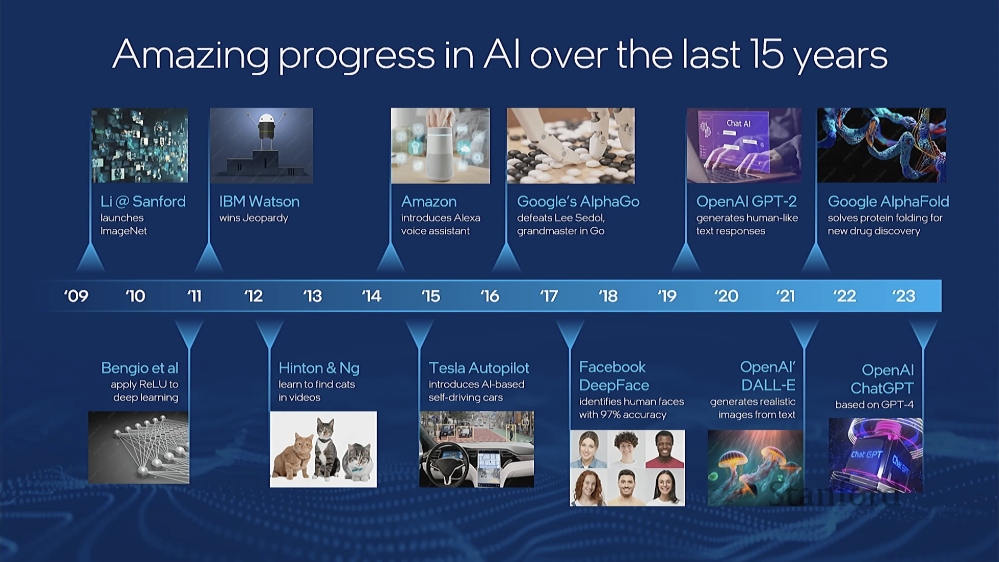
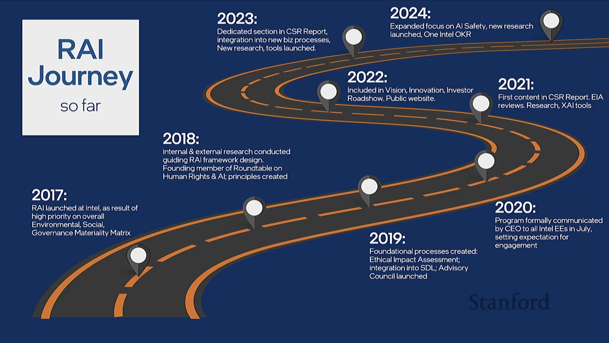
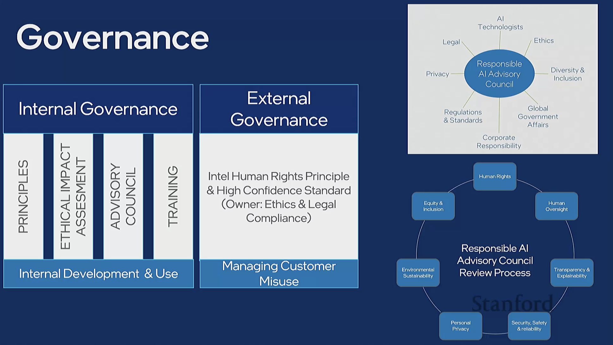

# Building a Responsible Al Framework
Insights from Intel by Lama Nachman 
Intel Sr Fellow, Director of Intelligent Systems Research, Intel Labs

**Stagnating developments in acuracy before deep learning**:
- Object recognition
- Speech recognition
- NLP (Natural Language Processing)

**2 pivotal moments in AI**:
- Moore's Law, processing power doubling every 18 months
- High level concept frameworks making training accessible to everyone

Before:
- Bespoke models ASR, NLP, CV
- High cost of development

Now:
- Open source frameworks
- Pre-trained models
- Transfer learning
- Generative models
- GPU acceleration

**From 2015 a lot of concerns emerged:**

**Bias - Privacy - Security - Safety - Accountability - Transparency - Fairness - Surveillance**

## Intel's journey to responsible AI
RAI - Responsible AI pursues positive outcomes and prevents negative results

People associate Intel with hardware, but they are also a software company:
- **OpenVINO** - Toolkit for deploying AI models on Intel hardware
- **OneAPI** - Toolkit for programming across different Intel hardware

**Intel established a ruleset for RAI**:

- Internal governance about ensuring AI adhears to ethical standards
- External governance about ensuring AI is used responsibly

Intel Advisery council built an AI expert network to provide capabilities for various AI projects. 