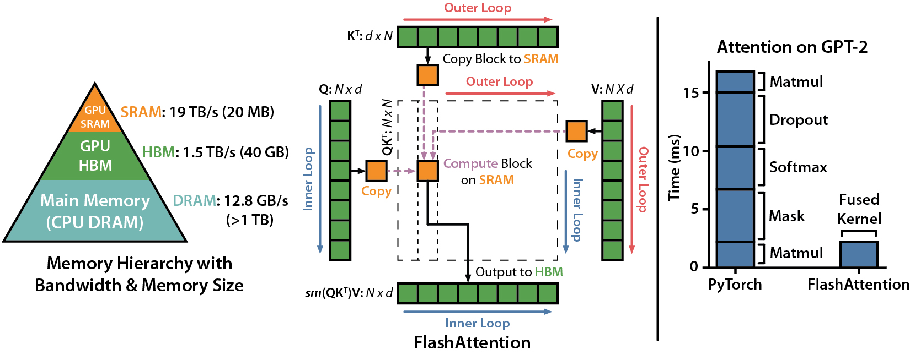

# Applied Computational AI
### Model, Software, and Hardware 

Talk by Wei Li, VP/GM of AI Software Engineering at Intel on July 24th 2024 at HPC AI Seminar at Stanford

## Computational AI Stack

- **Model**: Fast Changing
- **Software**: Performance, Ease of Use
- **Hardware**: CPU, GPU, TPU

## Use cases
**AI for Science**
Aurora genAI Model
State-of-the-art Generative AI Model for Scientific Discovery

**Customized ChatBot**
TA Bot answering questions:
"When is it best for me to use IPEX?"
- Used to accelerate deep learning on Intel hardware
- Train neural networks 
- Run inference on large datasets

**Quality Assistant**
Post automated Jira tickets 

**Research Projects** (Ideas)
- Deepfake Detection
- Halucination Detection

## Computational AI Acceleration
Performance gain of up to 10-100x

[Table 1](https://www.intel.com/content/www/us/en/developer/articles/technical/do-smaller-models-hallucinate-more.html#:~:text=Intel's%20neural%20chat%207B%20has,are%20much%20larger%20in%20size.): Vectara’s HHEM leaderboard, showing the hallucination rate for various commercial and open source LLMs.

## Acceleration at Model Level
**Transformer architecture** works by breaking down the input into smaller chunks and processing them in parallel.

- **Grouped-query attention (GQA) vs multi-head attention (MHA)**
    - GQA: 2x faster than MHA
    - GQA: Reduces bandwidth requirements for long keyws and values without sacrificing accuracy
    - E.g. LLama2 70B uses GQA for faster inference

- **Quantization to lower precision**
    - 8-or-4-bit quantization
    - Reduces memeory footprint and speeds up execution
    - E.g. QLoRA improves over LoRA by quantizing the transformer model to 4-bit precision

## Acceleration at Software Level
Don't want a data scientist to work hard and then scrap their work. 

- **Attention**
**[FlashAttention](https://github.com/Dao-AILab/flash-attention)**: A library for fast and efficient attention mechanisms in PyTorch

- Fusion of operations
- Parallelism
    - Data Parallelism
    - Tensor Parallelism
    - Pipeline Parallelism

## Acceleration at Hardware Level
Examples: CPU/AMX, GPU Xe, Gaudi

- **Systolic Array with many data types**
- **Programmer aware SRAM**
- **High bandwidth/low latency accelerator to accelerator communication** (NVLink, RoCE, UALink)

## Performance from Yesterday (new Llama Release)
https://www.intel.com/content/www/us/en/developer/articles/technical/intel-ai-solutions-support-meta-llama-3-1-launch.html

## Conclusion
Performance isn't everyting - AI Everywhere
People need to be able to use AI in simple manner
- Pytorch, TensorFlow, ONNX
- Hugging Face, FlashAttention
- Hardware access

**AI Model**
- fine tuned
- RAG

**AI Software**
- performance 
- productivity

**AI Hardware**
- CPU, GPU, TPU