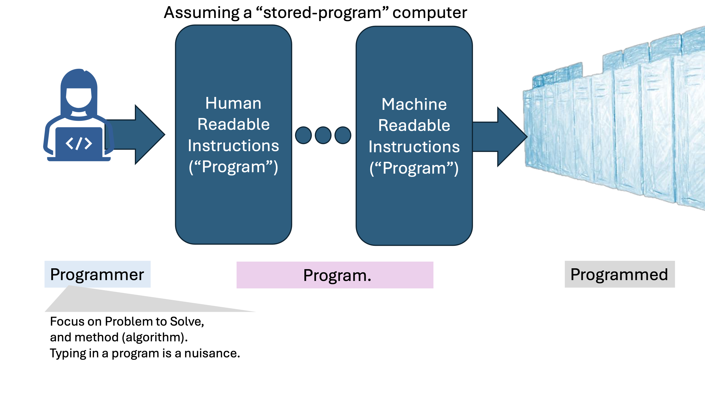
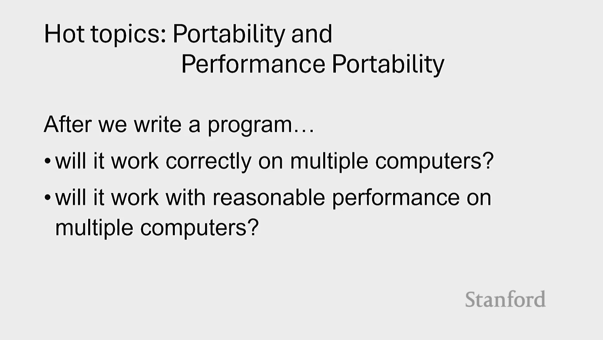
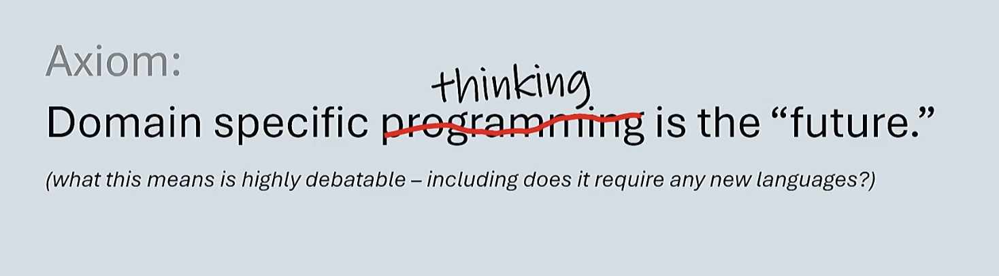
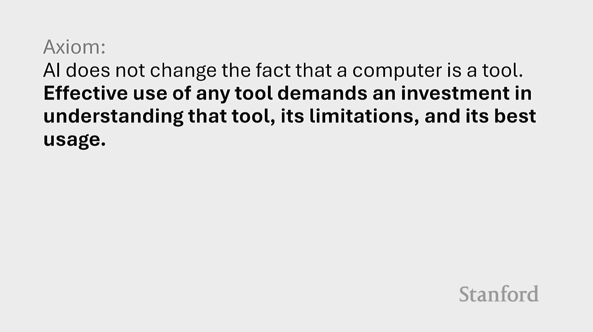
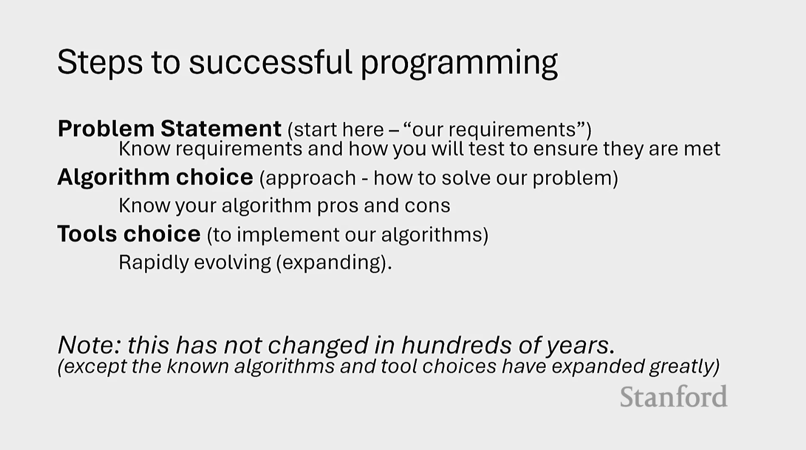

# Programming Languages and Paradigms: Navigating Towards a New Era

Presentation by James Reinders, Engineer at Intel for 35+ years, at Stanford HPC AI July 31st 2024

## What are Programming Languages and Paradigms?
"I love computer architectures,
and above all
the programming methods (languages, etc.)
we use to command them."

**Assembly language**:
- Directly corresponds to machine code
- Low-level programming language
- Difficult to read and write, had to use manuals by the CPU manufacturer

**High-level programming languages**:
- Easier to read and write
- More abstract, less tied to the hardware
- More portable, can run on different architectures

Example: Fortran, C, C++, Python, Java, and thousands more

## A programmer just wants to explain their problem

"The last thing we need is another programming language."

## Trends in software development
Programming languages became more general-purpose and high-level over time. 
The introduction of containers shows this trend.

Domain specific computing is uprising again because it's more power efficient and faster.
Probably not new languages but libraries. 

There were computers built just to run Lisp or Prolog code (e.g. Symbolics, LMI, etc.).
As hardware capabilities expand, so do languages.
The users involvement and requirements shape the languages.

"Do you really want to ride in a car programmed using C++?"

"Python libraries made the language successful, not the language itself."

## AI in Development
- Code Reviews: AI can help with code reviews, finding bugs, and suggesting improvements.
- Going to create more malware, but also more secure software.
- CoPilot: AI that helps with code completion, developed by GitHub and OpenAI.

Changed with Convoluted Neural Networks (CNNs) and Transformers. Now very reliable. 

## Programming in Science
Have programmers write the code, collaborative with the scientists.
- The programmers write the code
- The scientists write the algorithms

Have a clear picutre of what you want to do before you start programming.

- Start with knowledge of what already exists
- Stand on the shoulder of giants
- New is not always better

## Hot topics in computer design
- [Performance Portability](#trends-in-software-development)
- [Domain Specific Computing](#trends-in-software-development)
- Quantum Computing: Capable of solving problems previously thought to be intractable
- Neuromorphic Computing: Mimicking the neural structures of
the human brain to create more efficient, brain-like computing
processes
- New Domain-Specific Devices: Specialized hardware designed
to optimize specific tasks and applications
- Hotonic Devices: Utilizing light instead of electrical signals for
faster and more efficient data processing

## Conclusion
- Important skills: domain knowledge, logical thinking, creativity,
and tool mastery
- Al will enhance, but not replace these skills
- Programming will evolve as a result
- Stay curious and continue learning always