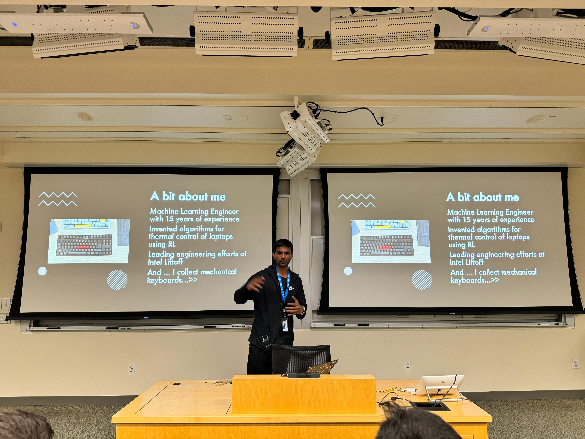

# Intel Liftoff Startup Program
Presentation by Rahul Unnikrishnan Nair, Intel AI Startup Program Manager, at Stanford HPC AI August 7th 2024

1. [AI Startup Ecosystem](#ai-startup-ecosystem)
2. AI Startup Playbook
3. Intel Liftoff: Empowering AI Startups
4. Membership and Collaboration
5. Taking Action

## AI Startup Ecosystem
Joining a startup incubator is more than just giving equity. 
Consider Startup Accelerators for guidance, ressources, networking, mentoring. 

**Gen AI Startup Ecosystem:**
- $13bn in 2023
- B2B >> B2C
- At least one technical co-founder
- Applied AI

Biggest Gen AI use case: **Assisted Automation + UX**
- Immedatie: Sales, Marketing, Education, Customer Service, Productivity
- Nascent: Energy, Healthcare, Manufacturing, AI Safety (LLM Guarding, Prompt Injection)

## Insights from Liftoff Team
Identify, Build, Iterate Scale
- Strong team and sector
    - 2 Technical Co-Founders
    - 1 Business Co-Founder
- Understand user needs, be intentional
- Problem that is solvable (and would make clients pay)
- Applied AI solution that is repeatable
- Outsource LLM to antother company if not building a LLM

## Insights from Liftoff Founders
- Validate with MVP
- Iterate with customer feedback
- Experiment and maybe pivot
- Networking

It's like a computer science problem: Start simple, expand and increase complexity. 

## Tips for building AI Products
- Model != Product
- Use APIs for MVP
- Use open-source tools
- Set up ethical standards
- Start with LLM inference and RAG to update knowledge
- Fine-tune SLM and SVLMs if custom LLM is needed
- Slowly swith to local model
- Use routing (e.g. RAG) for knowledge updates
- A/B testing
- Don't pay for compute until you have 1 customer

## Pop Quiz

LLM For Customer Support: Which of the following have the biggest impact on cost?

A. Training data aquisition, labeling
B. Model training
C. Inference service
D. AI engineers desining and optimizing the stack

It is C. Inferencing is the most expensive part of the process. Every time a model is tested or used, it costs money to an external provider.

## Navigating the AI Startup Journey
- Limited access to compute
- Technical expertise
- Difficulty gaining visibility
- Lack of peer review

Human interface part of AI is often overlooked.