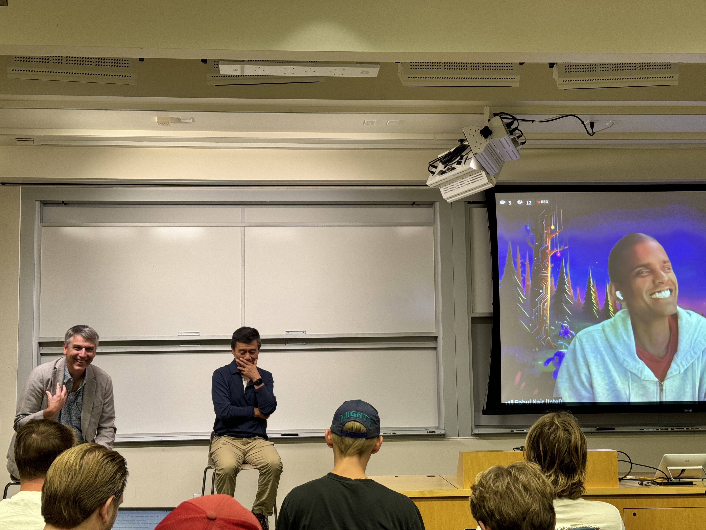

# HPC AI Panel at Stanford University
Hybrid Panel Event on AI and HPC at Skilling Auditorium, Stanford, August 14th 2024

## Panelists live:
- Adisson Snell, CEO of Intersect360 Research
- Wei Li, VP/GM of AI Software Engineering at Intel

## Panelist remote:
- James Reinders, Lead Engineer, at Intel
- Rahul Nair, Intel AI Startup Program Manager

**Determenistic Computation vs AI**
Open-Source vs Closed Ecosystem
C++ vs Python

Stacks like Kuda is building an ecosystem, althouth open-source

Open-Source:
- Keeps software alive and relevant to and by the community
- Collective of people from different companies and backgrounds 

Enterprises often only open data they do not care about or couldn't monitize. 

**Use-case driven vs best technology driven**
- Innovation doesn't happen with money, but when there is an incentive and drive. 
- San Francisco, Stanford and Startups at the front line of innovation. 
- Enterprises are looking at Startups and copy their structures: Agile, Rapid, Iterative, Cost aware (Money is a drug)

**AI Goldrush parallel to the WWW Dotcom trend**
- People haven't found gold yet: They don't know where the market value is
- AI is a comodity: It is easy to create applications with AI
- Give products not tools to customers

**The power is concentrated in the hyperscale companies**
Is that going to change?

Models vs Data
- All models are transformer based
- Fine tuning with individual data brings the power
- Data ownership going to be a hot topic

**Limiting factors for AI**
- Software developing faster than hardware
    - Migh plateau at some point
- Consuming more power than we have
    - Improving efficiency
    - Anecdote: Internet Bandwidth vs connectivity
    - Technology will run faster

**AI Revolutions** 
Convolutional Neural Networks (CNN) in 2006 started the Machine Learning (ML) trend

Quantum Computing
Not moving as fast as expected
"Always **feels like** 10 years away, now maybe 8"